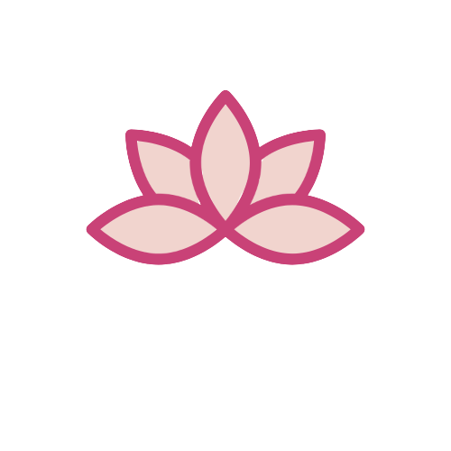

# Minute Mantras 
---


Throughout 2020 I relied on meditation to stay sane in quarantine, this is a project to bring a little sanity to any moment throughout the day

See Minute Mantra [here](https://minutemantra.netlify.app/).

---

## Mantras

For a lot of my practice I use mantras as an object of meditation. This means repeating the mantra over and over in my head and when my mind wanders just returning my focus back to the mantra.

I used a mantra class to generate new random instances of mantras in the CenterPanel

```javascript
import { identifiers, objects, verbs } from './Words'


export class Mantra {
  create(): string {
    const subject = identifiers[(Math.floor(Math.random() * identifiers.length))]

    const verb = verbs[(Math.floor(Math.random() * verbs.length))]

    const object = objects[(Math.floor(Math.random() * objects.length))]

    return `${subject} will ${verb} ${object}`;
  }

  
  
}
```
